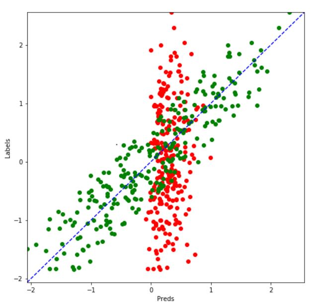

 # Predicting House Prices with Regression using Tensorflow 
 
 **We are going to work on evaluating price of houses given the follwing features:**
 * Year of sale of the house
 * The age of the house at the time of sale
 * Distance from city center
 * Number of stores in the locality
 * The latitude
 * The longitude

**Prediction**

*Red: Test data
*Green: Trained data
